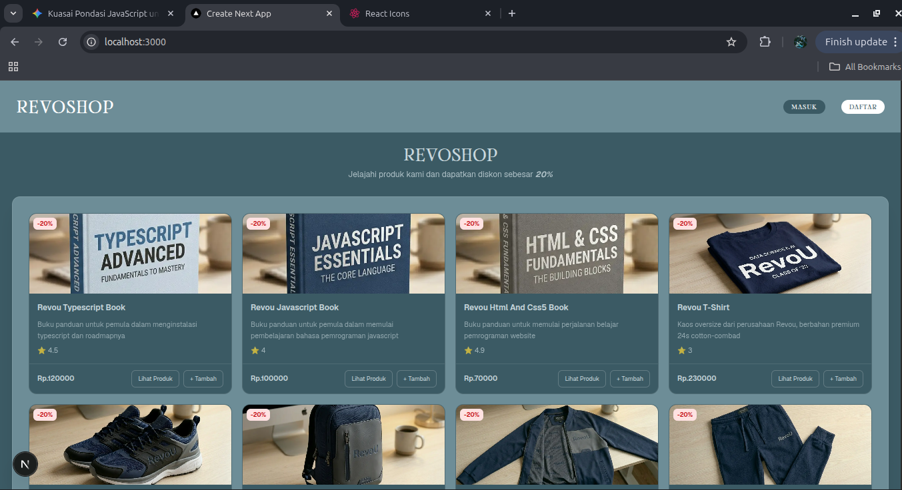
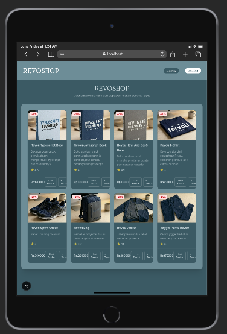
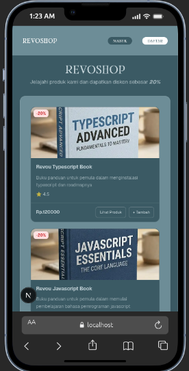

# RevoShop
 
RevoShop adalah website toko online sederhana yang dibangun menggunakan Next.js App Router. Project ini dibuat sebagai bagian dari tugas Module 4 Bootcamp RevoU Full Stack Software Engineering.
 
## Fitur
 
- Halaman utama menampilkan daftar produk serta link untuk login dan daftar
- Halaman detail produk dengan informasi lengkap
- Produk terkait berdasarkan kategori
- Navigasi client side tanpa reload halaman
- Tampilan responsif untuk mobile dan desktop


## Tech Stack 
- **Next.js 16** — App Router
- **React 19**
- **Tailwind CSS v4**
- **react-icons**
## Struktur Folder
 
```
src/app/
├── layout.js          
├── page.js             
├── globals.css
├── data/
│   └── data.js         
├── products/
│   └── [id]/
│       ├── page.js         
│       └── produkterkait.js 
├── login/
│   └── page.js
└── register/
    └── page.js
```
 
## Cara Menjalankan
 
1. Clone repository ini
```bash
git clone https://github.com/Revou-FSSE-Feb26/milestone-3-Kevin12er.git
```
 
2. Masuk ke folder project
```bash
cd milestone-3-Kevin12er/revoshop
```
 
3. Install dependencies
```bash
npm install
```
 
4. Jalankan development server
```bash
npm run dev
```
 
5. Buka browser dan akses `http://localhost:3000`
## Halaman
 
| Route | Deskripsi |
|---|---|
| `/` | Halaman utama — daftar semua produk |
| `/products/[id]` | Halaman detail produk |
| `/login` | Halaman login |
| `/register` | Halaman register |
 
## Author
Kevin — RevoU FSSE Batch Feb 2026

## Screenshoot





Kunjungi [Revoshop]()


 

 

 


